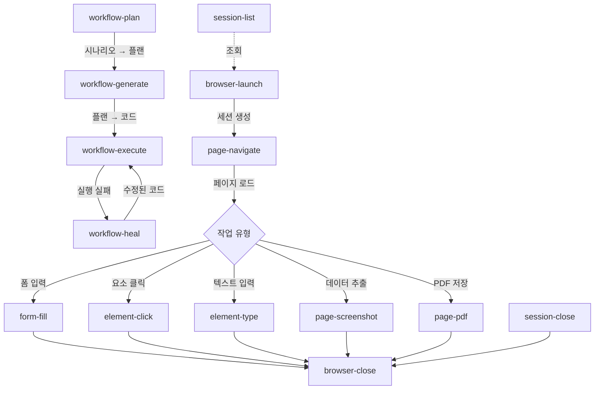

# OA webauto Plugin Architecture Design

## 목차

1. [개요](#개요)
2. [CLI 명령어 구조](#cli-명령어-구조)
3. [JSON 출력 스키마](#json-출력-스키마)
4. [Go 구조 설계](#go-구조-설계)
5. [Playwright Agents 통합](#playwright-agents-통합)
6. [Anti-Bot 우회 전략](#anti-bot-우회-전략)
7. [플랫폼 전략](#플랫폼-전략)
8. [AI 에이전트 최적화](#ai-에이전트-최적화)
9. [성능 목표](#성능-목표)
10. [에러 코드 정의](#에러-코드-정의)
11. [구현 우선순위](#구현-우선순위)

---

## 개요

webauto 플러그인은 Playwright Agents를 활용한 지능형 브라우저 자동화 플러그인으로, 한국 세무/회계 서비스(홈택스, 위하고 등)의 복잡한 UI 자동화를 지원합니다.

### 핵심 기능

**Agent-Based Automation** (4개 명령어):
- `workflow-plan`: Planner Agent로 웹사이트 탐색 및 테스트 플랜 생성
- `workflow-generate`: Generator Agent로 플랜을 Playwright 코드로 변환
- `workflow-execute`: 생성된 자동화 스크립트 실행
- `workflow-heal`: Healer Agent로 실패한 스크립트 자동 수리

**Direct Browser Control** (7개 명령어):
- `browser-launch`: 브라우저 시작
- `browser-close`: 브라우저 종료
- `page-navigate`: URL 이동
- `element-click`: 요소 클릭
- `element-type`: 텍스트 입력
- `element-get-text`: 텍스트 추출 ✨ NEW
- `form-fill`: 폼 자동 입력

**Data Extraction** (2개 명령어):
- `page-screenshot`: 스크린샷 촬영
- `page-pdf`: PDF 저장

**Session Management** (2개 명령어):
- `session-list`: 활성 세션 목록
- `session-close`: 세션 종료

**총 15개 명령어**

### 설계 원칙

1. **OA 표준 준수**: `<resource>-<action>` 명령어, `--<domain-noun>-<attribute>` 플래그
2. **AI Agent 우선**: Playwright Agents로 자동화 스크립트 자동 생성 및 유지보수
3. **Anti-Bot 강화**: Stealth mode, 행동 패턴 랜덤화, fingerprint 우회
4. **일관된 JSON 출력**: success/data/error/metadata 구조
5. **에러 복구 가능**: Healer Agent로 자가 치유, 명확한 에러 코드
6. **고성능**: 명령어 < 500ms, Agent 실행 5-30초
7. **AI 친화적**: 구조화된 출력, 자체 설명적 응답
8. **크로스 플랫폼**: Windows/macOS/Linux 지원 (Chromium/Firefox/WebKit)

---

## CLI 명령어 구조

### 1. 통합 명령어 인터페이스

```bash
# 기본 구조
oa webauto <command> [flags]

# 명령어 카테고리
- workflow-*   # Agent 기반 자동화 (고수준)
- browser-*    # 브라우저 제어 (저수준)
- page-*       # 페이지 제어 및 데이터 추출
- element-*    # 요소 조작
- form-*       # 폼 입력
- session-*    # 세션 관리
```

### 2. 명령어 상세 정의

#### Category 1: Agent-Based Automation (고수준)

##### workflow-plan

**설명**: Playwright Planner Agent로 웹사이트 탐색 및 자동화 시나리오 생성

**사용 사례**: 홈택스 세금계산서 조회 자동화 플랜 생성

**필수 플래그**:
```bash
--page-url <string>           # 대상 웹사이트 URL
--scenario-text <string>      # 자동화 시나리오 설명 (한글 지원)
```

**선택 플래그**:
```bash
--prd-file <path>             # Product Requirements Document 경로 (optional)
--output-path <path>          # 플랜 저장 경로 (default: plan.md)
--browser-type <string>       # 브라우저 (chromium|firefox|webkit, default: chromium)
--headless <bool>             # Headless 모드 (default: true)
```

**실행 예시**:
```bash
oa webauto workflow-plan \
  --page-url "https://hometax.go.kr" \
  --scenario-text "로그인 → 세금계산서 조회 → CSV 다운로드" \
  --output-path hometax_plan.md
```

**JSON 출력**:
```json
{
  "success": true,
  "data": {
    "plan_path": "hometax_plan.md",
    "steps_count": 8,
    "estimated_execution_time_ms": 15000,
    "planner_version": "playwright-1.56.0"
  },
  "error": null,
  "metadata": {
    "plugin": "webauto",
    "version": "1.0.0",
    "execution_time_ms": 8500
  }
}
```

---

##### workflow-generate

**설명**: Playwright Generator Agent로 Markdown 플랜을 실행 가능한 코드로 변환

**사용 사례**: 생성된 플랜을 TypeScript Playwright 코드로 변환

**필수 플래그**:
```bash
--plan-file <path>            # Markdown 플랜 파일 경로
```

**선택 플래그**:
```bash
--output-path <path>          # 생성된 스크립트 저장 경로 (default: automation.ts)
--language <string>           # 출력 언어 (ts|python|csharp, default: ts)
--validate-selectors <bool>   # 셀렉터 실시간 검증 (default: true)
```

**실행 예시**:
```bash
oa webauto workflow-generate \
  --plan-file hometax_plan.md \
  --output-path hometax_automation.ts \
  --language ts
```

**JSON 출력**:
```json
{
  "success": true,
  "data": {
    "script_path": "hometax_automation.ts",
    "commands_count": 12,
    "validation_status": "all selectors verified",
    "generator_version": "playwright-1.56.0"
  },
  "error": null,
  "metadata": {
    "plugin": "webauto",
    "version": "1.0.0",
    "execution_time_ms": 5200
  }
}
```

---

##### workflow-execute

**설명**: 생성된 Playwright 스크립트 실행

**사용 사례**: 홈택스 자동화 스크립트 실행

**필수 플래그**:
```bash
--script-file <path>          # 실행할 스크립트 파일 (*.ts, *.py, *.cs)
```

**선택 플래그**:
```bash
--headless <bool>             # Headless 모드 (default: true)
--timeout-ms <int>            # 타임아웃 (default: 30000)
--session-id <string>         # 세션 ID (optional, 세션 재사용)
--browser-type <string>       # 브라우저 (chromium|firefox|webkit, default: chromium)
```

**실행 예시**:
```bash
oa webauto workflow-execute \
  --script-file hometax_automation.ts \
  --headless false \
  --timeout-ms 60000
```

**JSON 출력**:
```json
{
  "success": true,
  "data": {
    "result": {
      "invoices_downloaded": 45,
      "csv_path": "/downloads/invoices_2025-10.csv"
    },
    "execution_log": "/tmp/webauto_log_20251013.txt",
    "session_id": "ses_abc123"
  },
  "error": null,
  "metadata": {
    "plugin": "webauto",
    "version": "1.0.0",
    "execution_time_ms": 12500
  }
}
```

---

##### workflow-heal

**설명**: Playwright Healer Agent로 실패한 스크립트 자동 수리

**사용 사례**: UI 변경으로 실패한 스크립트 자동 수정

**필수 플래그**:
```bash
--script-file <path>          # 수리할 스크립트 파일
```

**선택 플래그**:
```bash
--max-attempts <int>          # 최대 재시도 횟수 (default: 3)
--output-path <path>          # 수정된 스크립트 저장 경로 (optional)
--debug <bool>                # 디버그 모드 (default: false)
```

**실행 예시**:
```bash
oa webauto workflow-heal \
  --script-file hometax_automation.ts \
  --max-attempts 5 \
  --output-path hometax_automation_fixed.ts
```

**JSON 출력**:
```json
{
  "success": true,
  "data": {
    "healing_status": "success",
    "root_cause": "Element '#submit-btn' not found (likely UI changed)",
    "fix_applied": "Updated selector to '#submit-button' (line 42)",
    "retry_count": 2,
    "fixed_script_path": "hometax_automation_fixed.ts"
  },
  "error": null,
  "metadata": {
    "plugin": "webauto",
    "version": "1.0.0",
    "execution_time_ms": 8500
  }
}
```

---

#### Category 2: Direct Browser Control (저수준)

##### browser-launch

**설명**: 브라우저 인스턴스 시작

**사용 사례**: Chrome 브라우저 시작 및 세션 생성

**선택 플래그**:
```bash
--browser-type <string>       # 브라우저 (chromium|firefox|webkit, default: chromium)
--headless <bool>             # Headless 모드 (default: true)
--session-id <string>         # 세션 ID (optional, 재사용용)
--viewport-width <int>        # 뷰포트 너비 (default: 1920)
--viewport-height <int>       # 뷰포트 높이 (default: 1080)
--user-agent <string>         # User-Agent 오버라이드 (optional)
```

**실행 예시**:
```bash
oa webauto browser-launch \
  --browser-type chromium \
  --headless false \
  --viewport-width 1920 \
  --viewport-height 1080
```

**JSON 출력**:
```json
{
  "success": true,
  "data": {
    "session_id": "ses_abc123",
    "browser_type": "chromium",
    "headless": false,
    "viewport": {"width": 1920, "height": 1080},
    "user_agent": "Mozilla/5.0 ..."
  },
  "error": null,
  "metadata": {
    "plugin": "webauto",
    "version": "1.0.0",
    "execution_time_ms": 1500
  }
}
```

---

##### browser-close

**설명**: 브라우저 인스턴스 종료

**필수 플래그**:
```bash
--session-id <string>         # 종료할 세션 ID
```

**실행 예시**:
```bash
oa webauto browser-close --session-id ses_abc123
```

**JSON 출력**:
```json
{
  "success": true,
  "data": {
    "session_id": "ses_abc123",
    "browser_status": "closed"
  },
  "error": null,
  "metadata": {
    "plugin": "webauto",
    "version": "1.0.0",
    "execution_time_ms": 300
  }
}
```

---

##### page-navigate

**설명**: 특정 URL로 페이지 이동

**필수 플래그**:
```bash
--page-url <string>           # 이동할 URL
--session-id <string>         # 세션 ID
```

**선택 플래그**:
```bash
--wait-for <string>           # 대기 조건 (load|networkidle|domcontentloaded, default: load)
--timeout-ms <int>            # 타임아웃 (default: 30000)
```

**실행 예시**:
```bash
oa webauto page-navigate \
  --page-url "https://hometax.go.kr" \
  --session-id ses_abc123 \
  --wait-for networkidle
```

**JSON 출력**:
```json
{
  "success": true,
  "data": {
    "page_title": "홈택스 - 국세청",
    "page_url": "https://hometax.go.kr",
    "load_time_ms": 2500,
    "final_url": "https://hometax.go.kr/index.jsp"
  },
  "error": null,
  "metadata": {
    "plugin": "webauto",
    "version": "1.0.0",
    "execution_time_ms": 2800
  }
}
```

---

##### element-click

**설명**: 페이지 요소 클릭

**필수 플래그**:
```bash
--element-selector <string>   # CSS 셀렉터 또는 XPath
--session-id <string>         # 세션 ID
```

**선택 플래그**:
```bash
--wait-visible <bool>         # 요소가 보일 때까지 대기 (default: true)
--timeout-ms <int>            # 타임아웃 (default: 5000)
--click-count <int>           # 클릭 횟수 (default: 1, double-click: 2)
```

**실행 예시**:
```bash
oa webauto element-click \
  --element-selector "#login-button" \
  --session-id ses_abc123 \
  --wait-visible true
```

**JSON 출력**:
```json
{
  "success": true,
  "data": {
    "element_selector": "#login-button",
    "element_found": true,
    "clicked": true,
    "click_position": {"x": 150, "y": 300}
  },
  "error": null,
  "metadata": {
    "plugin": "webauto",
    "version": "1.0.0",
    "execution_time_ms": 450
  }
}
```

---

##### element-type

**설명**: 요소에 텍스트 입력 (타이핑 시뮬레이션)

**필수 플래그**:
```bash
--element-selector <string>   # CSS 셀렉터 또는 XPath
--text-input <string>         # 입력할 텍스트
--session-id <string>         # 세션 ID
```

**선택 플래그**:
```bash
--delay-ms <int>              # 타이핑 지연 (기본: 10-50ms 랜덤)
--clear-first <bool>          # 입력 전 초기화 (default: true)
```

**실행 예시**:
```bash
oa webauto element-type \
  --element-selector "#username" \
  --text-input "user123" \
  --session-id ses_abc123
```

**JSON 출력**:
```json
{
  "success": true,
  "data": {
    "element_selector": "#username",
    "text_length": 7,
    "typing_time_ms": 350
  },
  "error": null,
  "metadata": {
    "plugin": "webauto",
    "version": "1.0.0",
    "execution_time_ms": 400
  }
}
```

---

##### element-get-text

**설명**: 요소의 텍스트 내용 추출

**사용 사례**: 블로그 제목 수집, 플레이스 상호명 추출, 검색 결과 개수 확인

**필수 플래그**:
```bash
--element-selector <string>   # CSS 셀렉터 또는 XPath
--session-id <string>         # 세션 ID
```

**선택 플래그**:
```bash
--timeout-ms <int>            # 타임아웃 (default: 30000)
```

**실행 예시**:
```bash
oa webauto element-get-text \
  --element-selector ".blog-title" \
  --session-id ses_abc123
```

**JSON 출력**:
```json
{
  "success": true,
  "data": {
    "session_id": "ses_abc123",
    "element_selector": ".blog-title",
    "text": "Playwright로 웹 자동화하기",
    "element_count": 1
  },
  "error": null,
  "metadata": {
    "plugin": "webauto",
    "version": "1.0.0",
    "execution_time_ms": 15
  }
}
```

**다중 요소 처리**:
```bash
# 여러 블로그 제목 추출 (배열로 반환)
oa webauto element-get-text \
  --element-selector ".blog-title" \
  --session-id ses_abc123
```

**JSON 출력 (다중 요소)**:
```json
{
  "success": true,
  "data": {
    "session_id": "ses_abc123",
    "element_selector": ".blog-title",
    "text": [
      "Playwright로 웹 자동화하기",
      "브라우저 테스팅 완벽 가이드",
      "네이버 블로그 자동화 팁"
    ],
    "element_count": 3
  },
  "error": null,
  "metadata": {
    "plugin": "webauto",
    "version": "1.0.0",
    "execution_time_ms": 25
  }
}
```

---

##### form-fill

**설명**: 폼 자동 입력 (여러 필드 동시 처리)

**필수 플래그**:
```bash
--form-data <json>            # 폼 데이터 (JSON 형식)
--session-id <string>         # 세션 ID
```

**선택 플래그**:
```bash
--submit <bool>               # 입력 후 자동 제출 (default: false)
--submit-selector <string>    # 제출 버튼 셀렉터 (default: input[type="submit"])
```

**실행 예시**:
```bash
oa webauto form-fill \
  --form-data '{"username":"user1","password":"pass123","remember":"true"}' \
  --session-id ses_abc123 \
  --submit true
```

**JSON 출력**:
```json
{
  "success": true,
  "data": {
    "fields_filled": 3,
    "form_fields": ["username", "password", "remember"],
    "submitted": true
  },
  "error": null,
  "metadata": {
    "plugin": "webauto",
    "version": "1.0.0",
    "execution_time_ms": 1200
  }
}
```

---

#### Category 3: Data Extraction

##### page-screenshot

**설명**: 현재 페이지 스크린샷 촬영

**필수 플래그**:
```bash
--image-path <path>           # 스크린샷 저장 경로
--session-id <string>         # 세션 ID
```

**선택 플래그**:
```bash
--full-page <bool>            # 전체 페이지 캡처 (default: true)
--clip-x <int>                # 클립 영역 X 좌표 (optional)
--clip-y <int>                # 클립 영역 Y 좌표 (optional)
--clip-width <int>            # 클립 영역 너비 (optional)
--clip-height <int>           # 클립 영역 높이 (optional)
```

**실행 예시**:
```bash
oa webauto page-screenshot \
  --image-path screenshot.png \
  --session-id ses_abc123 \
  --full-page true
```

**JSON 출력**:
```json
{
  "success": true,
  "data": {
    "image_path": "screenshot.png",
    "image_size_bytes": 524288,
    "image_dimensions": {"width": 1920, "height": 3000},
    "image_format": "png"
  },
  "error": null,
  "metadata": {
    "plugin": "webauto",
    "version": "1.0.0",
    "execution_time_ms": 800
  }
}
```

---

##### page-pdf

**설명**: 현재 페이지 PDF 저장

**필수 플래그**:
```bash
--pdf-path <path>             # PDF 저장 경로
--session-id <string>         # 세션 ID
```

**선택 플래그**:
```bash
--pdf-format <string>         # 용지 크기 (A4|Letter|Legal, default: A4)
--landscape <bool>            # 가로 모드 (default: false)
--print-background <bool>     # 배경 인쇄 (default: true)
```

**실행 예시**:
```bash
oa webauto page-pdf \
  --pdf-path report.pdf \
  --session-id ses_abc123 \
  --pdf-format A4 \
  --landscape false
```

**JSON 출력**:
```json
{
  "success": true,
  "data": {
    "pdf_path": "report.pdf",
    "pdf_size_bytes": 1048576,
    "pdf_pages": 5,
    "pdf_format": "A4"
  },
  "error": null,
  "metadata": {
    "plugin": "webauto",
    "version": "1.0.0",
    "execution_time_ms": 1500
  }
}
```

---

#### Category 4: Session Management

##### session-list

**설명**: 현재 활성 세션 목록 조회

**선택 플래그**: (없음)

**실행 예시**:
```bash
oa webauto session-list
```

**JSON 출력**:
```json
{
  "success": true,
  "data": {
    "sessions": [
      {
        "session_id": "ses_abc123",
        "browser_type": "chromium",
        "headless": false,
        "created_at": "2025-10-13T15:30:00Z",
        "current_url": "https://hometax.go.kr",
        "memory_usage_mb": 150
      }
    ],
    "total_sessions": 1
  },
  "error": null,
  "metadata": {
    "plugin": "webauto",
    "version": "1.0.0",
    "execution_time_ms": 50
  }
}
```

---

##### session-close

**설명**: 특정 세션 종료

**필수 플래그**:
```bash
--session-id <string>         # 종료할 세션 ID
```

**실행 예시**:
```bash
oa webauto session-close --session-id ses_abc123
```

**JSON 출력**:
```json
{
  "success": true,
  "data": {
    "session_id": "ses_abc123",
    "session_status": "closed",
    "session_duration_seconds": 1800
  },
  "error": null,
  "metadata": {
    "plugin": "webauto",
    "version": "1.0.0",
    "execution_time_ms": 300
  }
}
```

---

### 3. 명령어 간 의존성 및 워크플로우



#### 일반적인 워크플로우 패턴

**1. Agent 기반 자동화 (권장)**:
```bash
# 1) 시나리오로부터 플랜 생성
oa webauto workflow-plan \
  --page-url "https://hometax.go.kr" \
  --scenario-text "로그인 → 세금계산서 조회 → CSV 다운로드" \
  --output-path hometax_plan.md

# 2) 플랜을 실행 가능한 코드로 변환
oa webauto workflow-generate \
  --plan-file hometax_plan.md \
  --output-path hometax_automation.ts

# 3) 자동화 실행
oa webauto workflow-execute \
  --script-file hometax_automation.ts \
  --headless false

# 4) 실패 시 자동 수리
oa webauto workflow-heal \
  --script-file hometax_automation.ts \
  --max-attempts 5
```

**2. Direct Control (수동 제어)**:
```bash
# 1) 브라우저 시작
oa webauto browser-launch --headless false
# → session_id: ses_abc123

# 2) 페이지 이동
oa webauto page-navigate \
  --page-url "https://hometax.go.kr" \
  --session-id ses_abc123

# 3) 폼 입력
oa webauto form-fill \
  --form-data '{"username":"user1","password":"pass123"}' \
  --session-id ses_abc123 \
  --submit true

# 4) 스크린샷 촬영
oa webauto page-screenshot \
  --image-path hometax_result.png \
  --session-id ses_abc123

# 5) 브라우저 종료
oa webauto browser-close --session-id ses_abc123
```

---

## JSON 출력 스키마

### 1. 표준 응답 구조

모든 명령어는 다음 표준 구조를 따릅니다:

```typescript
interface StandardResponse {
  success: boolean;
  data: object | null;
  error: ErrorInfo | null;
  metadata: Metadata;
}

interface ErrorInfo {
  code: string;  // UPPER_SNAKE_CASE
  message: string;
  details?: object;
  recovery_suggestion?: string;  // 복구 방법 제안
}

interface Metadata {
  plugin: "webauto";
  version: string;
  execution_time_ms: number;
}
```

### 2. 에러 응답 예시

```json
{
  "success": false,
  "data": null,
  "error": {
    "code": "ELEMENT_NOT_FOUND",
    "message": "Element with selector '#submit-btn' not found",
    "details": {
      "selector": "#submit-btn",
      "page_url": "https://hometax.go.kr",
      "timeout_ms": 5000
    },
    "recovery_suggestion": "Verify the selector is correct. Try using --wait-visible flag or increase --timeout-ms"
  },
  "metadata": {
    "plugin": "webauto",
    "version": "1.0.0",
    "execution_time_ms": 5200
  }
}
```

---

## Go 구조 설계

### 1. 패키지 구조

```
webauto/
├── cmd/
│   └── webauto/
│       └── main.go                 # 진입점
├── pkg/
│   ├── config/
│   │   └── config.go               # 환경 변수 로딩
│   ├── response/
│   │   ├── response.go             # StandardResponse 구조
│   │   └── errors.go               # ErrorInfo 구조
│   ├── cli/
│   │   ├── root.go                 # Cobra 루트 명령어
│   │   ├── workflow.go             # Agent 기반 명령어
│   │   ├── browser.go              # 브라우저 제어 명령어
│   │   ├── page.go                 # 페이지 제어 명령어
│   │   ├── element.go              # 요소 조작 명령어
│   │   ├── form.go                 # 폼 입력 명령어
│   │   └── session.go              # 세션 관리 명령어
│   ├── playwright/
│   │   ├── agent.go                # Playwright Agents 래퍼
│   │   ├── browser.go              # 브라우저 인스턴스 관리
│   │   ├── page.go                 # 페이지 제어
│   │   ├── element.go              # 요소 조작
│   │   └── session.go              # 세션 관리
│   ├── antibot/
│   │   ├── stealth.go              # Stealth mode 설정
│   │   ├── fingerprint.go          # Fingerprint 우회
│   │   └── behavior.go             # 행동 패턴 랜덤화
│   └── ipc/
│       └── node.go                 # Node.js subprocess 통신
├── internal/
│   └── utils/
│       ├── uuid.go                 # UUID 생성
│       ├── json.go                 # JSON 파싱
│       └── time.go                 # 시간 유틸리티
├── scripts/
│   └── playwright-setup.sh         # Playwright 환경 설정
├── docker/
│   └── Dockerfile                  # Docker 이미지 (Node.js 포함)
└── go.mod
```

### 2. 핵심 컴포넌트

#### main.go (`cmd/webauto/main.go`)

**목적**: 프로그램 진입점, CLI 초기화

```go
package main

import (
	"os"

	"github.com/oa-plugins/webauto/pkg/cli"
)

func main() {
	if err := cli.Execute(); err != nil {
		os.Exit(1)
	}
}
```

---

#### config.go (`pkg/config/config.go`)

**목적**: 환경 변수 로딩 및 기본값 설정

```go
package config

import (
	"os"
	"path/filepath"
	"runtime"
)

type Config struct {
	// Playwright
	PlaywrightNodePath    string
	PlaywrightAgentsPath  string
	PlaywrightCachePath   string

	// Browser
	DefaultBrowserType    string  // "chromium" | "firefox" | "webkit"
	DefaultHeadless       bool
	DefaultViewportWidth  int
	DefaultViewportHeight int

	// Session
	SessionMaxCount       int
	SessionTimeoutSeconds int

	// Anti-Bot
	EnableStealth         bool
	EnableFingerprint     bool
	EnableBehaviorRandom  bool
	TypingDelayMs         int  // 10-50ms
	MouseMoveJitterPx     int  // 5-15px
}

func Load() *Config {
	return &Config{
		PlaywrightNodePath:    getEnvOrDefault("PLAYWRIGHT_NODE_PATH", getDefaultNodePath()),
		PlaywrightAgentsPath:  getEnvOrDefault("PLAYWRIGHT_AGENTS_PATH", "@playwright/agents"),
		PlaywrightCachePath:   getEnvOrDefault("PLAYWRIGHT_CACHE_PATH", getDefaultCachePath()),

		DefaultBrowserType:    getEnvOrDefault("DEFAULT_BROWSER_TYPE", "chromium"),
		DefaultHeadless:       getEnvBoolOrDefault("DEFAULT_HEADLESS", true),
		DefaultViewportWidth:  getEnvIntOrDefault("DEFAULT_VIEWPORT_WIDTH", 1920),
		DefaultViewportHeight: getEnvIntOrDefault("DEFAULT_VIEWPORT_HEIGHT", 1080),

		SessionMaxCount:       getEnvIntOrDefault("SESSION_MAX_COUNT", 10),
		SessionTimeoutSeconds: getEnvIntOrDefault("SESSION_TIMEOUT_SECONDS", 3600),

		EnableStealth:         getEnvBoolOrDefault("ENABLE_STEALTH", true),
		EnableFingerprint:     getEnvBoolOrDefault("ENABLE_FINGERPRINT", true),
		EnableBehaviorRandom:  getEnvBoolOrDefault("ENABLE_BEHAVIOR_RANDOM", true),
		TypingDelayMs:         getEnvIntOrDefault("TYPING_DELAY_MS", 30),
		MouseMoveJitterPx:     getEnvIntOrDefault("MOUSE_MOVE_JITTER_PX", 10),
	}
}

func getDefaultNodePath() string {
	// Node.js 실행 파일 경로 탐색
	return "node"
}

func getDefaultCachePath() string {
	switch runtime.GOOS {
	case "windows":
		return filepath.Join(os.Getenv("LOCALAPPDATA"), "oa", "webauto", "cache")
	default:
		home, _ := os.UserHomeDir()
		return filepath.Join(home, ".cache", "oa", "webauto")
	}
}

func getEnvOrDefault(key, defaultValue string) string {
	if value := os.Getenv(key); value != "" {
		return value
	}
	return defaultValue
}

func getEnvBoolOrDefault(key string, defaultValue bool) bool {
	value := os.Getenv(key)
	if value == "true" || value == "1" {
		return true
	}
	if value == "false" || value == "0" {
		return false
	}
	return defaultValue
}

func getEnvIntOrDefault(key string, defaultValue int) int {
	// Implementation...
	return defaultValue
}
```

---

#### response.go (`pkg/response/response.go`)

**목적**: 표준 JSON 응답 구조

```go
package response

import (
	"encoding/json"
	"fmt"
	"os"
	"time"
)

type StandardResponse struct {
	Success  bool        `json:"success"`
	Data     interface{} `json:"data"`
	Error    *ErrorInfo  `json:"error"`
	Metadata Metadata    `json:"metadata"`
}

type ErrorInfo struct {
	Code               string      `json:"code"`
	Message            string      `json:"message"`
	Details            interface{} `json:"details,omitempty"`
	RecoverySuggestion string      `json:"recovery_suggestion,omitempty"`
}

type Metadata struct {
	Plugin          string `json:"plugin"`
	Version         string `json:"version"`
	ExecutionTimeMs int64  `json:"execution_time_ms"`
}

func Success(data interface{}, startTime time.Time) *StandardResponse {
	return &StandardResponse{
		Success: true,
		Data:    data,
		Error:   nil,
		Metadata: Metadata{
			Plugin:          "webauto",
			Version:         "1.0.0",
			ExecutionTimeMs: time.Since(startTime).Milliseconds(),
		},
	}
}

func Error(code, message, recovery string, details interface{}, startTime time.Time) *StandardResponse {
	return &StandardResponse{
		Success: false,
		Data:    nil,
		Error: &ErrorInfo{
			Code:               code,
			Message:            message,
			Details:            details,
			RecoverySuggestion: recovery,
		},
		Metadata: Metadata{
			Plugin:          "webauto",
			Version:         "1.0.0",
			ExecutionTimeMs: time.Since(startTime).Milliseconds(),
		},
	}
}

func (r *StandardResponse) Print() {
	encoder := json.NewEncoder(os.Stdout)
	encoder.SetIndent("", "  ")
	encoder.Encode(r)
}
```

---

#### agent.go (`pkg/playwright/agent.go`)

**목적**: Playwright Agents (Planner/Generator/Healer) 래퍼

```go
package playwright

import (
	"context"
	"encoding/json"
	"fmt"
	"os/exec"
	"time"

	"github.com/oa-plugins/webauto/pkg/config"
)

type AgentManager struct {
	cfg *config.Config
}

func NewAgentManager(cfg *config.Config) *AgentManager {
	return &AgentManager{cfg: cfg}
}

// Planner Agent: 웹사이트 탐색 및 테스트 플랜 생성
func (am *AgentManager) Plan(ctx context.Context, url, scenario, outputPath string) (PlanResult, error) {
	cmd := exec.CommandContext(ctx, am.cfg.PlaywrightNodePath,
		"-e", fmt.Sprintf(`
			const { planner } = require('%s');
			(async () => {
				const result = await planner.explore('%s', { scenario: '%s' });
				await planner.savePlan(result, '%s');
				console.log(JSON.stringify({ steps: result.steps.length }));
			})();
		`, am.cfg.PlaywrightAgentsPath, url, scenario, outputPath))

	output, err := cmd.Output()
	if err != nil {
		return PlanResult{}, fmt.Errorf("planner failed: %w", err)
	}

	var result PlanResult
	if err := json.Unmarshal(output, &result); err != nil {
		return PlanResult{}, fmt.Errorf("parse planner result: %w", err)
	}

	return result, nil
}

// Generator Agent: 플랜을 실행 가능한 코드로 변환
func (am *AgentManager) Generate(ctx context.Context, planFile, outputPath, language string) (GenerateResult, error) {
	cmd := exec.CommandContext(ctx, am.cfg.PlaywrightNodePath,
		"-e", fmt.Sprintf(`
			const { generator } = require('%s');
			const fs = require('fs');
			(async () => {
				const plan = fs.readFileSync('%s', 'utf8');
				const code = await generator.generate(plan, { language: '%s' });
				fs.writeFileSync('%s', code);
				console.log(JSON.stringify({ commands: code.split('\\n').length }));
			})();
		`, am.cfg.PlaywrightAgentsPath, planFile, language, outputPath))

	output, err := cmd.Output()
	if err != nil {
		return GenerateResult{}, fmt.Errorf("generator failed: %w", err)
	}

	var result GenerateResult
	if err := json.Unmarshal(output, &result); err != nil {
		return GenerateResult{}, fmt.Errorf("parse generator result: %w", err)
	}

	return result, nil
}

// Healer Agent: 실패한 스크립트 자동 수리
func (am *AgentManager) Heal(ctx context.Context, scriptFile, outputPath string, maxAttempts int) (HealResult, error) {
	cmd := exec.CommandContext(ctx, am.cfg.PlaywrightNodePath,
		"-e", fmt.Sprintf(`
			const { healer } = require('%s');
			(async () => {
				const result = await healer.heal('%s', { maxAttempts: %d });
				if (result.fixed) {
					require('fs').writeFileSync('%s', result.fixedCode);
				}
				console.log(JSON.stringify({
					status: result.fixed ? 'success' : 'failed',
					rootCause: result.rootCause,
					fixApplied: result.fixApplied,
					retryCount: result.retryCount
				}));
			})();
		`, am.cfg.PlaywrightAgentsPath, scriptFile, maxAttempts, outputPath))

	output, err := cmd.Output()
	if err != nil {
		return HealResult{}, fmt.Errorf("healer failed: %w", err)
	}

	var result HealResult
	if err := json.Unmarshal(output, &result); err != nil {
		return HealResult{}, fmt.Errorf("parse healer result: %w", err)
	}

	return result, nil
}

type PlanResult struct {
	StepsCount int `json:"steps"`
}

type GenerateResult struct {
	CommandsCount int `json:"commands"`
}

type HealResult struct {
	Status     string `json:"status"`
	RootCause  string `json:"rootCause"`
	FixApplied string `json:"fixApplied"`
	RetryCount int    `json:"retryCount"`
}
```

---

#### session.go (`pkg/playwright/session.go`)

**목적**: 브라우저 세션 관리

```go
package playwright

import (
	"context"
	"fmt"
	"sync"
	"time"

	"github.com/google/uuid"
	"github.com/oa-plugins/webauto/pkg/config"
)

type SessionManager struct {
	cfg      *config.Config
	sessions map[string]*Session
	mu       sync.RWMutex
}

type Session struct {
	ID          string
	BrowserType string
	Headless    bool
	CreatedAt   time.Time
	LastUsedAt  time.Time
	Browser     interface{} // Playwright browser instance
	Page        interface{} // Playwright page instance
}

func NewSessionManager(cfg *config.Config) *SessionManager {
	return &SessionManager{
		cfg:      cfg,
		sessions: make(map[string]*Session),
	}
}

func (sm *SessionManager) Create(ctx context.Context, browserType string, headless bool) (*Session, error) {
	sm.mu.Lock()
	defer sm.mu.Unlock()

	if len(sm.sessions) >= sm.cfg.SessionMaxCount {
		return nil, fmt.Errorf("max sessions reached (%d)", sm.cfg.SessionMaxCount)
	}

	sessionID := uuid.New().String()
	session := &Session{
		ID:          sessionID,
		BrowserType: browserType,
		Headless:    headless,
		CreatedAt:   time.Now(),
		LastUsedAt:  time.Now(),
	}

	// Launch browser via Playwright
	// (Implementation with actual Playwright library)

	sm.sessions[sessionID] = session
	return session, nil
}

func (sm *SessionManager) Get(sessionID string) (*Session, error) {
	sm.mu.RLock()
	defer sm.mu.RUnlock()

	session, ok := sm.sessions[sessionID]
	if !ok {
		return nil, fmt.Errorf("session not found: %s", sessionID)
	}

	session.LastUsedAt = time.Now()
	return session, nil
}

func (sm *SessionManager) Close(sessionID string) error {
	sm.mu.Lock()
	defer sm.mu.Unlock()

	session, ok := sm.sessions[sessionID]
	if !ok {
		return fmt.Errorf("session not found: %s", sessionID)
	}

	// Close browser via Playwright
	// (Implementation)

	delete(sm.sessions, sessionID)
	return nil
}

func (sm *SessionManager) List() []*Session {
	sm.mu.RLock()
	defer sm.mu.RUnlock()

	sessions := make([]*Session, 0, len(sm.sessions))
	for _, session := range sm.sessions {
		sessions = append(sessions, session)
	}
	return sessions
}

func (sm *SessionManager) Cleanup() {
	sm.mu.Lock()
	defer sm.mu.Unlock()

	timeout := time.Duration(sm.cfg.SessionTimeoutSeconds) * time.Second
	now := time.Now()

	for sessionID, session := range sm.sessions {
		if now.Sub(session.LastUsedAt) > timeout {
			// Close and delete expired session
			delete(sm.sessions, sessionID)
		}
	}
}
```

---

## Playwright Agents 통합

### 1. Playwright 환경 설정

**Node.js 의존성**:
```json
{
  "name": "oa-webauto",
  "version": "1.0.0",
  "dependencies": {
    "playwright": "^1.56.0",
    "@playwright/agents": "^1.56.0"
  }
}
```

**설치 스크립트** (`scripts/playwright-setup.sh`):
```bash
#!/bin/bash
set -e

echo "Installing Playwright and Agents..."
npm install playwright @playwright/agents

echo "Installing Playwright browsers..."
npx playwright install chromium firefox webkit

echo "Playwright setup completed!"
```

### 2. Agent 통신 프로토콜

**Go ↔ Node.js 통신**:
1. Go가 Node.js 프로세스를 subprocess로 실행
2. stdin/stdout으로 JSON 메시지 교환
3. 타임아웃 설정 (Planner: 60초, Generator: 30초, Healer: 90초)
4. 에러 처리 및 재시도 로직

**메시지 형식**:
```json
{
  "command": "plan",
  "params": {
    "url": "https://hometax.go.kr",
    "scenario": "로그인 → 세금계산서 조회 → CSV 다운로드"
  }
}
```

**응답 형식**:
```json
{
  "success": true,
  "data": {
    "steps_count": 8,
    "plan_path": "plan.md"
  },
  "error": null
}
```

---

## Anti-Bot 우회 전략

### 1. Playwright Stealth Mode

**자동 적용 기능**:
- ✅ WebDriver 플래그 자동 숨김 (`navigator.webdriver = undefined`)
- ✅ 실제 브라우저 Fingerprint 사용
- ✅ Headless 모드 탐지 우회
- ✅ 자연스러운 이벤트 시뮬레이션

**구현**:
```go
// pkg/antibot/stealth.go
package antibot

func ApplyStealth(page interface{}) error {
	// Playwright의 Stealth 플러그인 적용
	// (Node.js subprocess 호출)
	return nil
}
```

### 2. Fingerprint 우회

**User-Agent 로테이션**:
```go
var userAgents = []string{
	"Mozilla/5.0 (Windows NT 10.0; Win64; x64) AppleWebKit/537.36 (KHTML, like Gecko) Chrome/119.0.0.0 Safari/537.36",
	"Mozilla/5.0 (Macintosh; Intel Mac OS X 10_15_7) AppleWebKit/537.36 (KHTML, like Gecko) Chrome/119.0.0.0 Safari/537.36",
	"Mozilla/5.0 (X11; Linux x86_64) AppleWebKit/537.36 (KHTML, like Gecko) Chrome/119.0.0.0 Safari/537.36",
}

func GetRandomUserAgent() string {
	return userAgents[rand.Intn(len(userAgents))]
}
```

### 3. 행동 패턴 랜덤화

**타이핑 지연**:
```go
// pkg/antibot/behavior.go
func GetTypingDelay() int {
	// 10-50ms 랜덤 지연
	return 10 + rand.Intn(40)
}
```

**마우스 이동 Jitter**:
```go
func AddMouseJitter(x, y int) (int, int) {
	// ±5-15px 랜덤 이동
	jitter := 5 + rand.Intn(10)
	return x + (rand.Intn(2*jitter) - jitter), y + (rand.Intn(2*jitter) - jitter)
}
```

### 4. Rate Limiting

**요청 간격 제어**:
```go
const minRequestInterval = 500 * time.Millisecond

func Sleep() {
	time.Sleep(minRequestInterval + time.Duration(rand.Intn(500))*time.Millisecond)
}
```

---

## 플랫폼 전략

### 1. 지원 플랫폼

✅ **Windows** (10, 11)
✅ **macOS** (11+, Intel/Apple Silicon)
✅ **Linux** (Ubuntu 20.04+)

### 2. 플랫폼별 고려사항

#### Windows
- **Node.js 경로**: `C:\Program Files\nodejs\node.exe`
- **캐시 경로**: `%LOCALAPPDATA%\oa\webauto\cache`
- **브라우저**: Chromium, Firefox, (WebKit 제한적)

#### macOS
- **Node.js 경로**: `/usr/local/bin/node`
- **캐시 경로**: `~/.cache/oa/webauto`
- **브라우저**: Chromium, Firefox, WebKit 모두 지원

#### Linux
- **Node.js 경로**: `/usr/bin/node`
- **캐시 경로**: `~/.cache/oa/webauto`
- **브라우저**: Chromium, Firefox (WebKit 제한적)
- **Dependencies**: `libnss3`, `libatk1.0-0` 등 (Playwright 요구사항)

### 3. 빌드 전략

```bash
# Windows
GOOS=windows GOARCH=amd64 go build -o webauto.exe

# macOS (Intel)
GOOS=darwin GOARCH=amd64 go build -o webauto

# macOS (Apple Silicon)
GOOS=darwin GOARCH=arm64 go build -o webauto

# Linux
GOOS=linux GOARCH=amd64 go build -o webauto
```

---

## AI 에이전트 최적화

### 1. 구조화된 출력

**일관된 JSON 형식**:
- 모든 명령어가 동일한 `StandardResponse` 구조 사용
- `success` 필드로 성공/실패 즉시 판단
- `data` 필드에 명령어별 구조화된 결과
- `error.code`로 에러 유형 분류

### 2. 에러 메시지 명확화

**구조화된 에러**:
```json
{
  "code": "ELEMENT_NOT_FOUND",
  "message": "Element with selector '#submit-btn' not found",
  "details": {
    "selector": "#submit-btn",
    "page_url": "https://hometax.go.kr",
    "timeout_ms": 5000
  },
  "recovery_suggestion": "Verify the selector is correct. Try using --wait-visible flag or increase --timeout-ms"
}
```

### 3. 상태 검사 명령어

**세션 상태 조회**:
```bash
oa webauto session-list
```

**용도**:
- AI 에이전트가 활성 세션 확인
- 메모리 사용량 모니터링
- 세션 재사용 여부 판단

### 4. 명령어 체이닝

**워크플로우: Agent 기반 자동화**:
```bash
# 1) 플랜 생성
oa webauto workflow-plan \
  --page-url "https://hometax.go.kr" \
  --scenario-text "로그인 → 세금계산서 조회 → CSV 다운로드"

# 2) 코드 생성
oa webauto workflow-generate --plan-file plan.md

# 3) 실행
oa webauto workflow-execute --script-file automation.ts

# 4) 실패 시 자동 수리
oa webauto workflow-heal --script-file automation.ts
```

---

## 성능 목표

### 1. 응답 시간 목표

| 명령어 카테고리 | 목표 시간 | 시나리오 | 최적화 전략 |
|----------------|----------|----------|------------|
| Agent 기반 | 5-30초 | workflow-plan/generate/heal | Node.js subprocess 최적화, 캐싱 |
| 브라우저 제어 | < 500ms | browser-launch/close | 브라우저 인스턴스 재사용, 병렬 처리 |
| 페이지 제어 | < 1000ms | page-navigate | 네트워크 대기 최적화, timeout 설정 |
| 요소 조작 | < 300ms | element-click/type | 셀렉터 최적화, wait 전략 |
| 데이터 추출 | < 1000ms | page-screenshot/pdf | 이미지 압축, 병렬 처리 |
| 세션 관리 | < 100ms | session-list/close | 메모리 캐시, 빠른 조회 |

**전체 평균 목표** (Agent 제외): **< 500ms**

---

### 2. 리소스 사용 목표

**메모리**:
- 세션 1개: < 150MB
- 세션 5개: < 500MB
- 세션 10개 (최대): < 1GB

**CPU**:
- Idle: < 1%
- 브라우저 실행 중: < 20%
- Agent 실행 중: < 50%

**디스크 I/O**:
- 캐시 사용: < 500MB
- 스크린샷/PDF: 임시 파일 사용 후 삭제

---

### 3. 최적화 전략

**브라우저 인스턴스 재사용**:
- 세션 관리로 브라우저 재사용
- 동일 도메인 내 페이지 이동 시 브라우저 유지

**병렬 처리**:
- 멀티 세션 동시 실행 (최대 10개)
- Agent 실행 중 다른 명령어 병렬 처리 가능

**캐싱**:
- Playwright 브라우저 바이너리 캐싱
- Agent 생성 코드 템플릿 캐싱

---

## 에러 코드 정의

### 공통 에러 코드

| 코드 | 메시지 | 발생 상황 | 복구 방법 |
|------|--------|----------|----------|
| `NODE_NOT_FOUND` | Node.js not found in PATH | Node.js 미설치 | Install Node.js from https://nodejs.org |
| `PLAYWRIGHT_NOT_INSTALLED` | Playwright not installed | Playwright 미설치 | Run 'npm install playwright @playwright/agents' |
| `TIMEOUT_EXCEEDED` | Operation timeout exceeded: {timeout}ms | 타임아웃 초과 | Increase --timeout-ms or check network connection |
| `SESSION_NOT_FOUND` | Session with ID {session_id} not found | 존재하지 않는 세션 | Use 'oa webauto session-list' to see active sessions |
| `SESSION_LIMIT_REACHED` | Max sessions reached ({limit}) | 최대 세션 수 초과 | Close unused sessions or increase SESSION_MAX_COUNT |

### Agent 관련 에러 코드

| 코드 | 메시지 | 발생 상황 | 복구 방법 |
|------|--------|----------|----------|
| `PLANNER_FAILED` | Planner Agent failed: {details} | 플랜 생성 실패 | Check URL accessibility and scenario clarity |
| `GENERATOR_FAILED` | Generator Agent failed: {details} | 코드 생성 실패 | Verify plan file format and structure |
| `HEALER_FAILED` | Healer Agent failed to fix script | 자가 치유 실패 | Manual inspection required, check script logs |
| `SCRIPT_EXECUTION_FAILED` | Script execution failed: {error} | 스크립트 실행 실패 | Run with --debug flag or use workflow-heal |

### 브라우저 관련 에러 코드

| 코드 | 메시지 | 발생 상황 | 복구 방법 |
|------|--------|----------|----------|
| `BROWSER_LAUNCH_FAILED` | Failed to launch browser: {browser_type} | 브라우저 시작 실패 | Check Playwright installation and browser binaries |
| `BROWSER_CONNECTION_LOST` | Browser connection lost | 브라우저 연결 끊김 | Restart session or check network stability |
| `PAGE_LOAD_FAILED` | Page failed to load: {url} | 페이지 로드 실패 | Check URL validity and network connection |
| `PAGE_TIMEOUT` | Page load timeout: {timeout}ms | 페이지 로드 타임아웃 | Increase --timeout-ms or check network speed |

### 요소 관련 에러 코드

| 코드 | 메시지 | 발생 상황 | 복구 방법 |
|------|--------|----------|----------|
| `ELEMENT_NOT_FOUND` | Element with selector {selector} not found | 요소를 찾을 수 없음 | Verify selector or use --wait-visible flag |
| `ELEMENT_NOT_VISIBLE` | Element is not visible: {selector} | 요소가 보이지 않음 | Wait for element to be visible or scroll to element |
| `ELEMENT_NOT_CLICKABLE` | Element is not clickable: {selector} | 요소 클릭 불가 | Check if element is covered or disabled |
| `FORM_VALIDATION_FAILED` | Form validation failed: {details} | 폼 유효성 검사 실패 | Verify form data matches input requirements |

### Anti-Bot 관련 에러 코드

| 코드 | 메시지 | 발생 상황 | 복구 방법 |
|------|--------|----------|----------|
| `CAPTCHA_DETECTED` | CAPTCHA detected on page | CAPTCHA 발견 | Manual CAPTCHA solving required or use CAPTCHA service |
| `BOT_DETECTION_TRIGGERED` | Bot detection triggered: {details} | 봇 탐지됨 | Enable stealth mode or randomize behavior patterns |
| `RATE_LIMIT_EXCEEDED` | Rate limit exceeded: {limit} | Rate limit 초과 | Wait and retry or use different IP address |
| `ACCESS_DENIED` | Access denied by server: {status} | 서버 접근 거부 | Check if website blocks automation or verify credentials |

---

## 구현 우선순위

### Phase 1: MVP (2개월)

**목표**: 핵심 기능 구현 및 Playwright Agents 통합 검증

**구현 명령어**:
1. `browser-launch`: 브라우저 시작
2. `browser-close`: 브라우저 종료
3. `page-navigate`: URL 이동
4. `element-click`: 요소 클릭
5. `page-screenshot`: 스크린샷 촬영

**기술 구현**:
- ✅ Go + Node.js subprocess 통신
- ✅ Playwright 브라우저 제어 (Chromium만)
- ✅ 세션 관리 (단일 세션)
- ✅ 표준 JSON 응답
- ✅ 기본 에러 핸들링

**완료 기준**:
- [ ] Linux에서 브라우저 제어 동작
- [ ] 홈택스 로그인 페이지 이동 성공
- [ ] 스크린샷 촬영 성공
- [ ] 단위 테스트 커버리지 > 60%

---

### Phase 2: Playwright Agents 통합 (1.5개월)

**목표**: Planner/Generator/Healer Agents 통합 및 고급 기능 구현

**구현 명령어**:
6. `workflow-plan`: Planner Agent 통합
7. `workflow-generate`: Generator Agent 통합
8. `workflow-execute`: 스크립트 실행
9. `workflow-heal`: Healer Agent 통합
10. `element-type`: 텍스트 입력
11. `form-fill`: 폼 자동 입력
12. `session-list`: 세션 목록 조회
13. `session-close`: 세션 종료

**기술 구현**:
- ✅ Playwright Agents (@playwright/agents) 통합
- ✅ Anti-Bot 기본 기능 (Stealth mode)
- ✅ 멀티 세션 관리 (최대 10개)
- ✅ Firefox/WebKit 지원
- ✅ 에러 코드 체계

**완료 기준**:
- [ ] 홈택스 자동화 스크립트 자동 생성
- [ ] Agent로 생성된 코드 실행 성공
- [ ] Healer로 실패한 스크립트 자동 수리 성공
- [ ] 단위 테스트 커버리지 > 75%

---

### Phase 3: 크로스 플랫폼 및 Anti-Bot 강화 (1개월)

**목표**: Windows/macOS 지원, Anti-Bot 강화, 프로덕션 레디

**구현 명령어**:
14. `page-pdf`: PDF 저장

**기술 구현**:
- ✅ Windows/macOS 플랫폼 지원
- ✅ Anti-Bot 강화 (Fingerprint, 행동 패턴 랜덤화)
- ✅ Docker 이미지 (Node.js 포함)
- ✅ 성능 최적화 (< 500ms 응답 목표)
- ✅ 에러 핸들링 강화
- ✅ 로깅 시스템

**문서화**:
- ✅ README.md (설치, 사용법, 법적 고지)
- ✅ API 문서 (모든 명령어)
- ✅ 사용 가이드 (워크플로우 예시)
- ✅ 트러블슈팅 가이드

**완료 기준**:
- [ ] Windows/macOS/Linux 모두 동작
- [ ] 홈택스/위하고 봇 탐지 우회 성공
- [ ] 평균 응답 시간 < 500ms (Agent 제외)
- [ ] 단위 테스트 커버리지 > 80%
- [ ] E2E 테스트 커버리지 > 85%
- [ ] 문서 완성도 100%

---

### Phase 4: 고급 기능 (향후)

**잠재적 기능**:
- 🔮 Chrome Extension 지원 (브라우저 내 통합)
- 🔮 Visual Testing (스크린샷 비교, 회귀 테스트)
- 🔮 Multi-Agent Orchestration (여러 Agent 동시 실행)
- 🔮 Proxy 로테이션 (IP 분산)
- 🔮 CAPTCHA 솔버 통합
- 🔮 WebSocket 실시간 통신

**목표**: 엔터프라이즈급 브라우저 자동화

---

## 다음 단계

1. **설계 검토 및 승인**: 팀 리뷰 및 피드백 수집
2. **Playwright 환경 구축**: Node.js, Playwright, Agents 설치 검증
3. **프로토타입 개발**: Phase 1 명령어 5개로 POC
4. **구현 가이드 생성**: `/oa:plugin:generate-impl-guide webauto`
5. **개발 시작**: plugin-template 기반 구현
6. **품질 검증**: `/oa:plugin:evaluate webauto`

---

## 참고 자료

- [아이디어 제안서](../ideas/webauto-idea.md)
- [OA Plugin Standards](https://github.com/oa-plugins/plugin-designer/blob/main/PRD.md#5-플러그인-간-조율-프로세스)
- [Plugin Template](https://github.com/oa-plugins/plugin-template)
- [Playwright Official Docs](https://playwright.dev/)
- [Playwright Agents](https://playwright.dev/docs/test-agents)
- [Playwright for Go](https://github.com/playwright-community/playwright-go)
- [SeleniumBase Undetected ChromeDriver](https://github.com/seleniumbase/SeleniumBase)
- [Kameleo Anti-Detect Browser](https://kameleo.io/)

---

**작성 완료일**: 2025-10-13
**다음 리뷰 일정**: 2025-10-27
